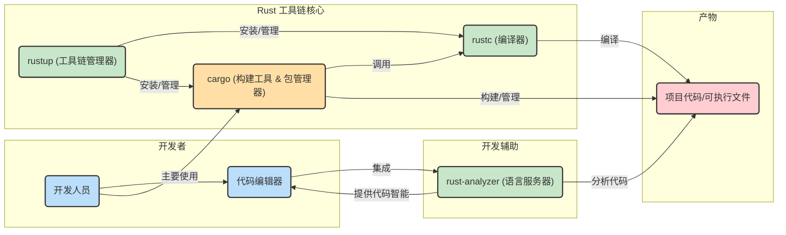
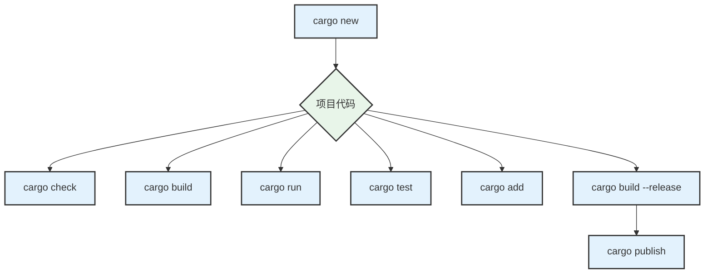
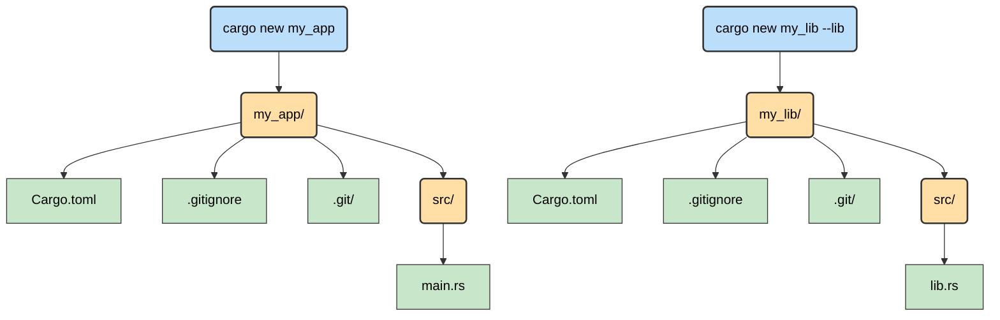
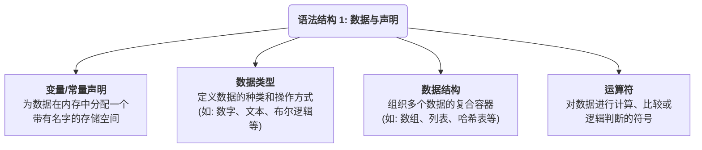
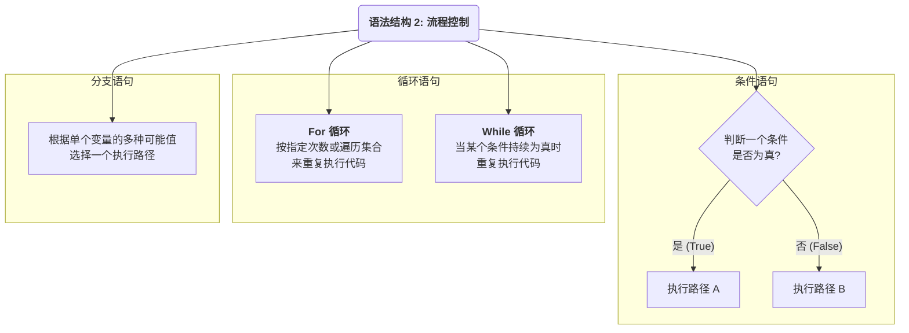
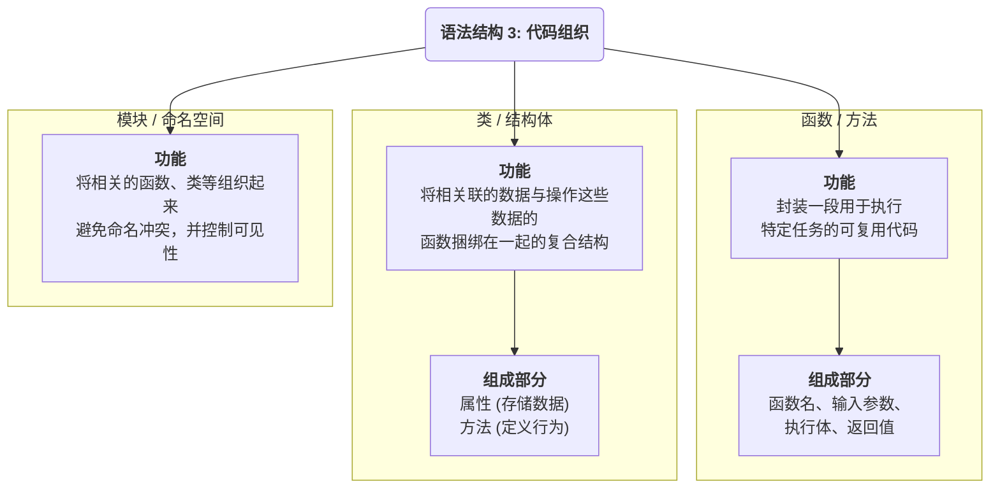

```mermaid
graph LR;
    subgraph "开发者"
        A("开发人员") --> E("代码编辑器");
    end

    subgraph "Rust 工具链核心"
        RU("rustup (工具链管理器)");
        RC("rustc (编译器)");
        CG("cargo (构建工具 & 包管理器)");
    end

    subgraph "开发辅助"
        RA("rust-analyzer (语言服务器)");
    end

    subgraph "产物"
        P("项目代码/可执行文件");
    end

    A -- "主要使用" --> CG;
    RU -- "安装/管理" --> RC;
    RU -- "安装/管理" --> CG;
    
    CG -- "调用" --> RC;
    CG -- "构建/管理" --> P;
    RC -- "编译" --> P;

    E -- "集成" --> RA;
    RA -- "分析代码" --> P;
    RA -- "提供代码智能" --> E;

    classDef main fill:#ffdfa5,stroke:#333,stroke-width:2px;
    classDef tool fill:#c8e6c9,stroke:#333,stroke-width:2px;
    classDef dev fill:#bbdefb,stroke:#333,stroke-width:2px;
    classDef artifact fill:#ffcdd2,stroke:#333,stroke-width:2px;

    class A,E dev;
    class RU,RC,CG,RA tool;
    class P artifact;
    class CG main;
```

```mermaid
graph TD;
    A["cargo new"] --> B{"项目代码"};
    
    B --> C["cargo check"];
    B --> D["cargo build"];
    B --> E["cargo run"];
    B --> F["cargo test"];

    B --> G["cargo add"];
    
    B --> H["cargo build --release"];
    H --> I["cargo publish"];

    classDef command fill:#e3f2fd,stroke:#333,stroke-width:2px;
    classDef project fill:#e8f5e9,stroke:#333,stroke-width:2px;
    class A,C,D,E,F,G,H,I command;
    class B project;
```

```mermaid
graph TD
    %% 二进制应用 (Binary) 的结构
    A("cargo new my_app") --> R1("my_app/");
    R1 --> F1["Cargo.toml"];
    R1 --> F2[".gitignore"];
    R1 --> F3[".git/"];
    R1 --> D1("src/");
    D1 --> F4["main.rs"];

    %% 库 (Library) 的结构
    B("cargo new my_lib --lib") --> R2("my_lib/");
    R2 --> F5["Cargo.toml"];
    R2 --> F6[".gitignore"];
    R2 --> F7[".git/"];
    R2 --> D2("src/");
    D2 --> F8["lib.rs"];

    %% 节点的样式定义
    classDef command fill:#bbdefb,stroke:#333,stroke-width:2px,color:#000;
    classDef dir fill:#ffdfa5,stroke:#333,stroke-width:2px,color:#000;
    classDef file fill:#c8e6c9,stroke:#333,stroke-width:1px,color:#000;

    %% 应用样式
    class A,B command;
    class R1,D1,R2,D2 dir;
    class F1,F2,F3,F4,F5,F6,F7,F8 file;
```

```mermaid
graph TD;
    A("<b>语法结构 1: 数据与声明</b>");
    A --> B["<b>变量/常量声明</b><br/>为数据在内存中分配一个<br/>带有名字的存储空间"];
    A --> C["<b>数据类型</b><br/>定义数据的种类和操作方式<br/>(如: 数字、文本、布尔逻辑等)"];
    A --> D["<b>数据结构</b><br/>组织多个数据的复合容器<br/>(如: 数组、列表、哈希表等)"];
    A --> E["<b>运算符</b><br/>对数据进行计算、比较或<br/>逻辑判断的符号"];
```

```mermaid
graph TD;
    A("<b>语法结构 2: 流程控制</b>");

    subgraph "条件语句"
        B{"判断一个条件<br/>是否为真?"}
        B --"是 (True)"--> B1["执行路径 A"]
        B --"否 (False)"--> B2["执行路径 B"]
    end

    subgraph "循环语句"
        C["<b>For 循环</b><br/>按指定次数或遍历集合<br/>来重复执行代码"]
        D["<b>While 循环</b><br/>当某个条件持续为真时<br/>重复执行代码"]
    end

    subgraph "分支语句"
         E["根据单个变量的多种可能值<br/>选择一个执行路径"]
    end

    A --> B;
    A --> C & D;
    A --> E;
```

```mermaid
graph TD;
    A("<b>语法结构 3: 代码组织</b>");

    subgraph "函数 / 方法"
        B["<b>功能</b><br/>封装一段用于执行<br/>特定任务的可复用代码"]
        B --> B1["<b>组成部分</b><br/>函数名、输入参数、<br/>执行体、返回值"]
    end
    
    subgraph "类 / 结构体"
        C["<b>功能</b><br/>将相关联的数据与操作这些数据的<br/>函数捆绑在一起的复合结构"]
        C --> D["<b>组成部分</b><br/>属性 (存储数据)<br/>方法 (定义行为)"]
    end
    
    subgraph "模块 / 命名空间"
        E["<b>功能</b><br/>将相关的函数、类等组织起来<br/>避免命名冲突，并控制可见性"]
    end

    A --> B;
    A --> C;
    A --> E;
```

